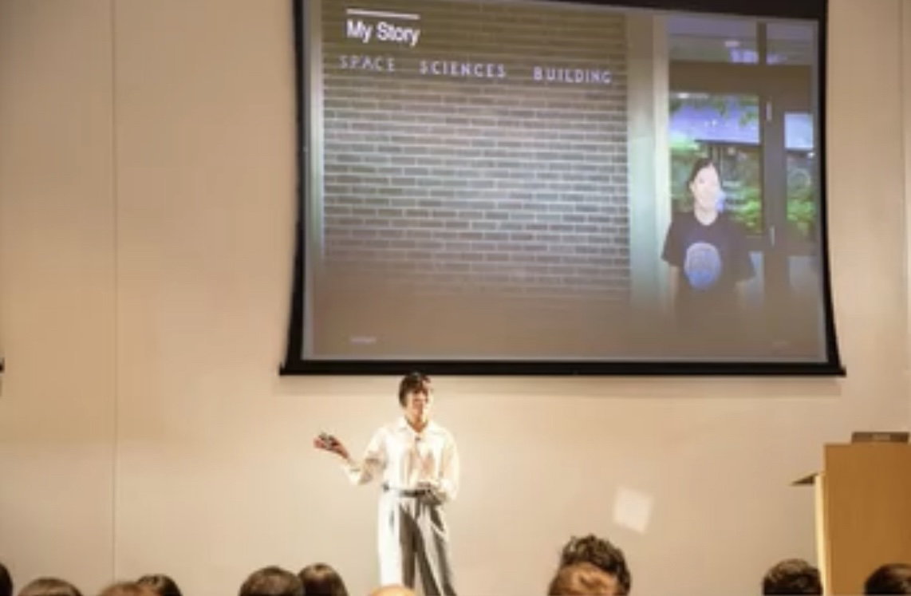
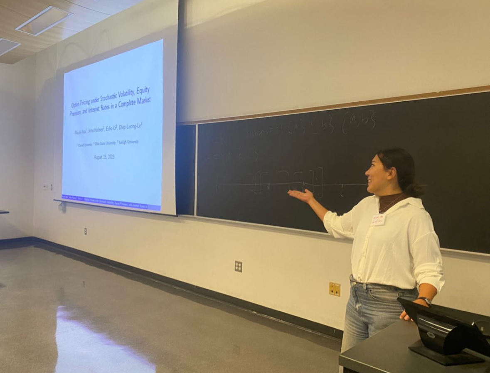
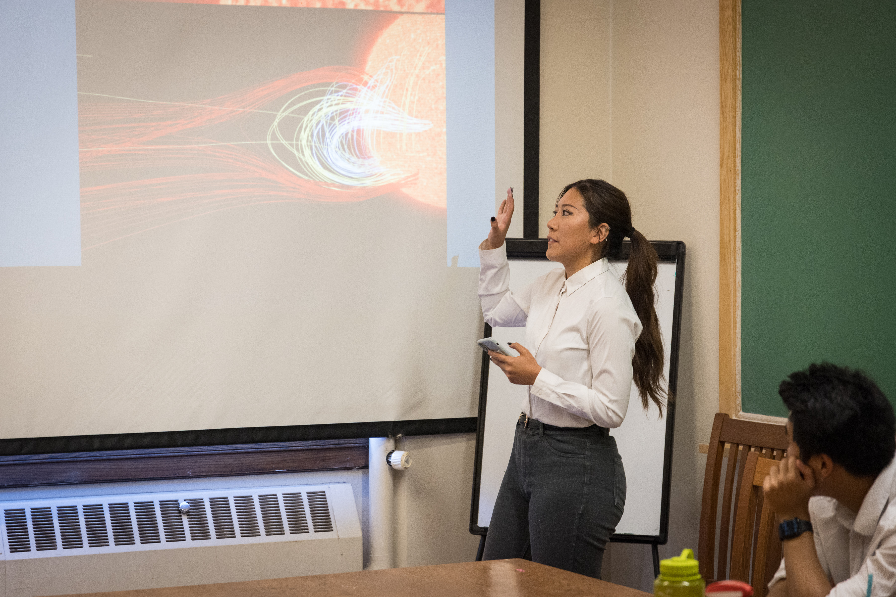

I'm Nicole Hao, a MEng student in Computer Science at Cornell University. Previously, I received my B.A. in Mathematics from Cornell in Dec 2024. 

I'm passionate about multi-sensory AI and human-centered technology. My current work focuses on developing tools that leverage Retrieval-Augmented Generation (RAG), deep learning, and multimodal systems to address real-world challenges in education and accessibility. 

I believe that AI will one day augment human cognition and help build a more just and equitable world - one where physical or cognitive challenges no longer limit a person’s potential.

Fun fact: I'm a practicing Buddhist. Yes, I go on mediation retreats. Don't get me started on Buddhism (and my screen time).

# Research Projects
I’ve worked on both engineering and research projects, using **applied math** and **ML/AI** to solve problems in natural sciences, education, and finance.

-  **[InkSight AI](https://github.com/Cornell-InkSight/InkSightMVP.git)**  
Do you know that many students with visual impairments are charged as much as $100 per hour for note-taking assistance, just to access the same classroom content as everyone else? This is why me and a few other Cornell students did months of research and developed InkSight AI. InkSight AI is an education platform that captures information across modalities, making real-time, multi-sensory learning possible and affordable for every learner.I was lucky enough to be selected by [the Cornell eLab Student Startup Accelerator](https://eship.cornell.edu/elab-welcomes-24-student-startup-teams-to-fall-cohort/) as part of their Fall 24 cohort with this project.  
**Demo coming soon.**

- **[Multimodal STEM Lecture Video Dataset & Data Labeling Tool](https://github.com/Cornell-InkSight/InkSight-DataLabeler.git)**  
I developed a multimodal STEM lecture video dataset and a custom data labeling tool to support AI models that interpret complex classroom content. The tool enables precise annotation of visual, textual, and auditory elements, such as handwritten equations, diagrams, and spoken explanations—laying the groundwork for accessible, multisensory learning systems.  
**Demo coming soon.**

- **[Classifying Solar Flares Using Supervised ML](https://github.com/nicolehao34/solar_flares_classification)**  
  Developed a machine learning pipeline to classify solar flares using real-world data. Improved prediction accuracy for solar flare events. I was mentored by [Prof. Ray Jayawardhana](https://www.drrayjay.net/) and Dr. Laura Flagg. Our research results were published in [the Astrophysical Journal](https://iopscience.iop.org/article/10.3847/1538-4357/ad5be3).

- **[Minimization of Differential Lateral Acceleration for Starshade Stationkeeping](https://github.com/nicolehao34/starshade_stationkeeping)**  
  Developed algorithms to minimize lateral acceleration differences in spacecraft stationkeeping for starshade missions, improving alignment precision for exoplanet imaging. I was mentored by PhD students and Prof. Dmitry Savransky in the [Cornell SIOS lab](https://sioslab.mae.cornell.edu/).

# Engineering Projects

- **[LeadGen.AI](https://github.com/nicolehao34/LeadGen.AI)**  
An AI-powered sales search & outreach platform for targeted B2B leads based on your ideal customer profile. The system automates finding and qualifying sales leads by researching industry events and trade associations where potential customers might be present. ⭐ Check out the new [Demo](https://GenLead-AI-nicolehao7.replit.app) and [loom walkthrough](https://www.loom.com/share/127c02e726394d038c29dd18419ce4d8?sid=7ff1b0c6-f1e7-4877-93ee-48ea8ae139ca) 

- **[RAG Exam Review Bot](https://github.com/nicolehao34/ai-pdf-chatbot)**  
A transformer-based exam prep assistant that retrieves and summarizes lecture content from PDFs, course websites, and discussion forums.  
**Demo coming soon.**

---

# Talks & Presentations
I LOVE pitching and giving speeches! Nothing excites me more than getting on stage in front of a crowd and presenting an exciting idea, product, or research findings.

- **InkSight: Empowering All Learners with AI**  
  [Cornell Tech Entrepreneurship Showcase](https://gradcareers.cornell.edu/event/cornell-entrepreneurship-showcase-student-pitches-venture-panel/), Nov 2024   
    

- **Option Pricing under Stochastic Volatility, Change in Equity Premium, and Interest Rates in a Complete Market**  
  [Young Mathematicians Conference (YMC)](efaidnbmnnnibpcajpcglclefindmkaj/https://ymc.osu.edu/sites/default/files/2023-08/ymc_2023-2.pdf), [Joint Mathematics Meetings (JMM)](https://jointmathematicsmeetings.org/meetings/national/jmm2024/2300_presenters.html), 2024  
  *(Based on [an applied math research project](https://arxiv.org/abs/2408.15416) I worked on with Prof. John Holmes at OSU)*   
  <!--    -->

- **Detecting and Classifying Flares in High-resolution Solar Spectra with Supervised Machine Learning**  
  [Nexus Scholars](https://as.cornell.edu/news/nexus-scholar-applications-open-summer-2023), Rochester Symposium for Physics Students (RSPS), 2023  
  *(I was a physics major! I may not be actively doing research in astrophysics now, but it will always be the most exalted form of curiosity to me.)*   
  <!--    -->

------

# Recent Reads

- *[The Second Half](https://ysymyth.github.io/The-Second-Half/)* - A great blog by Shunyu Yao on the development of AI, and the shift to evaluation setup in terms of the most important problem of AI.
- *[How to Do Great Work](https://www.paulgraham.com/greatwork.html)* - An amazing essay by Paul Graham. When in doubt, "stay upwind". This phrase stuck with me. 
- *[The Meaning of Meaningless: The Importance of Meaninglessness](https://www.amazon.com/Meaning-Meaningless-Importance-Meaninglessness-Publication-ebook/dp/B0DJ1J5DLH)* - By Dr. Nanige Nashiko. I don't think there is an English translation for this book yet. It's a great book about being able to derive joy from doing meaningless activities in a meaning-driven world. <be>
「無意味を楽しむことが、最も意味のある生き方だ。」Finding joy in the meaningless is the most meaningful way to live.
- *[Agency is Eating the World](https://giansegato.com/essays/agency-is-eating-the-world)* - by Gian Segato. "AI has eroded the value of specialization because, for many tasks, achieving the outcome of several years of experience now takes a $20 ChatGPT subscription." Agency has become one of the most desirable traits among working professionals.
- More to be added...

_Last updated: May 2025_
