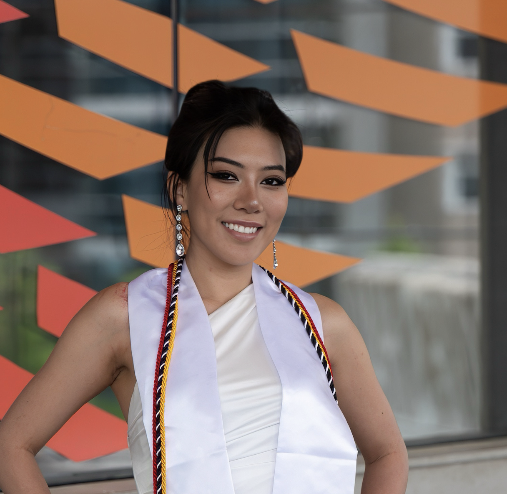

I'm Nicole Hao, a MEng student in Computer Science at Cornell University. Previously, I received my B.A. in Mathematics from Cornell in Dec 2024. 

Professionally, I work at the intersection of R&D and GTM strategy, specifically, using multimodal AI and RAG to help *people* improve their productivity and help *enterprises* scale. 

I come from an academic research background in mathematics, machine learning, and astrophysics, with a focus on building applied AI systems that bridge theoretical models and real-world use cases. My work integrates complex, multimodal data, including language, vision, and unstructured information, to power tools that enable scalable, enterprise-ready AI solutions.

Outside of work, I lead several nonprofit initiatives focused on advancing accessibility in education.

I'm passionate about multi-sensory AI and human-centered technology. My current work focuses on developing tools that leverage Retrieval-Augmented Generation (RAG) and Vision-Language Models (VLMs) to build multimodal systems that address challenges in education and accessibility. 

I believe that AI will one day augment human cognition and help build a more just and equitable world - one where physical or cognitive challenges no longer limit a person’s potential.

Fun fact: I'm a practicing Buddhist. Yes, I go on mediation retreats. Don't get me started on Buddhism (and my screen time).

# Research Projects
I've led both engineering and research projects, grounded in the belief that impactful work begins with innovation, and research is at the heart of that.  

My research centers on applying **math** and **AI/ML** to solve real-world problems in science and education.

-  **[InkSight AI](https://github.com/Cornell-InkSight/InkSightMVP.git)**  
Do you know that many students with visual impairments are charged as much as $100 per hour for note-taking assistance, just to access the same classroom content as everyone else?   This is why me, [Arjun Maitra](https://arjunmaitra.com/) (Cornell Math & Stats 28'), and [Clément Rozé](https://clementroze.com/) (Cornell Info Sci 28') did months of research and developed InkSight AI. InkSight AI is an education platform that captures information across modalities, making real-time, multi-sensory learning possible and affordable for every learner. I was lucky enough to be selected by [the Cornell eLab Student Startup Accelerator](https://eship.cornell.edu/elab-welcomes-24-student-startup-teams-to-fall-cohort/) as part of their Fall 24 cohort with this project.  
**Work in Progress. Demo coming soon.**

- **[Multimodal STEM Lecture Video Dataset & Data Labeling Tool](https://github.com/Cornell-InkSight/InkSight-DataLabeler.git)**  
I developed a multimodal STEM lecture video dataset and a custom data labeling tool to support models ranging from FCNs to VLMs that interpret complex classroom content. The tool enables precise annotation of visual, textual, and auditory elements, such as handwritten equations, diagrams, and spoken explanations, laying the groundwork for accessible, multisensory learning systems. I was advised by [Prof. Jennifer Sun](https://jenjsun.com/) for this project.  
**Work in Progress. Demo coming soon.**

- **[Operator Learning in Sobolev Spaces](https://github.com/nicolehao34/Operator-Learning-in-Sobolev-Spaces/blob/1e5a854088be6fa6befb59d4af8f21b874ac209c/MATH_6220_Final_Project%20(3).pdf)**  
This project bridges functional analysis and operator learning to (more rigorously) analyze how deep neural networks approximate nonlinear operators between Sobolev spaces. I built on the universal approximation in Sobolev norms and derived an original theorem that gives an explicit bound on the neural network complexity to approximate a nonlinear operator between Sobolev spaces.

- **[Evaluations on Response-Based Knowledge Distillation and the Effects of
Alpha on Model Accuracy](https://github.com/nicolehao34/Knowledge-Distillation-Effects-Of-Alpha/blob/ef5b7dce5d1f4a334c3b56c916856047dd087c86/Knowledge_Distillation_Final_Report.pdf)**  
I conducted this research project under the guidance of [Prof. Yunan Yang](https://yunany.github.io/) to investigate the effects of the alpha parameter in response-based knowledge distillation using MNIST data. By implementing a custom distillation framework in Keras, I analyzed how varying alpha values influence student model accuracy in contrast to direct learning from data and guidance from a teacher model. The study provides more information on optimizing model compression and generalization performance in low-resource settings.

- **[Classifying Solar Flares Using Supervised ML](https://github.com/nicolehao34/solar_flares_classification)**  
Under the mentorship of [Prof. Ray Jayawardhana](https://www.drrayjay.net/) and [Dr. Laura Flagg](https://lauraflagg.github.io/), I developed a novel supervised learning pipeline to detect and classify solar flares using high-resolution solar spectra from the RHESSI and HARPS-N missions. We trained several machine learning models and found that a Support Vector Classifier with an RBF kernel achieved the highest performance. Our work demonstrates that even subtle spectral changes from weak flares can be detected algorithmically, paving the way for future applications in mitigating stellar contamination in exoplanet studies. Our research results were published in [the Astrophysical Journal](https://iopscience.iop.org/article/10.3847/1538-4357/ad5be3).

# Engineering Projects
To me, innovation is not just about research - building a viable product and gaining traction are equally important. 

My engineering projects focus on **business** and **finance**, specifically, using AI to improve productivity and workflows.

- **[LeadGen.AI](https://github.com/nicolehao34/LeadGen.AI)**  
An AI-powered sales search & outreach platform for targeted B2B leads based on your ideal customer profile. The system automates finding and qualifying sales leads by researching industry events and trade associations where potential customers might be present. ⭐ Check out the new [Demo](https://GenLead-AI-nicolehao7.replit.app) and [loom walkthrough](https://www.loom.com/share/127c02e726394d038c29dd18419ce4d8?sid=7ff1b0c6-f1e7-4877-93ee-48ea8ae139ca) 

- **Cornell AI Innovation Lab Projects**  
I was selected to work at the [Cornell AI Innovation lab](https://it.cornell.edu/ai-innovation-lab). I was involved in different projects building RAG-based AI agents that improve productivity and give AI-generated second-opinions at the Cornell Agricultural and Life Sciences School and the Cornell Vet School. 

------

# Talks & Presentations
I LOVE pitching and giving speeches! Nothing excites me more than getting on stage in front of a crowd and presenting an exciting idea, product, or research findings.

- **InkSight: Empowering All Learners with AI**  
  [Cornell Tech Entrepreneurship Showcase](https://gradcareers.cornell.edu/event/cornell-entrepreneurship-showcase-student-pitches-venture-panel/), Nov 2024   
    

- **Option Pricing under Stochastic Volatility, Change in Equity Premium, and Interest Rates in a Complete Market**  
  [Young Mathematicians Conference (YMC)](efaidnbmnnnibpcajpcglclefindmkaj/https://ymc.osu.edu/sites/default/files/2023-08/ymc_2023-2.pdf), [Joint Mathematics Meetings (JMM)](https://jointmathematicsmeetings.org/meetings/national/jmm2024/2300_presenters.html), 2024  
  *(Based on [an applied math research project](https://arxiv.org/abs/2408.15416) I worked on with Prof. John Holmes at OSU)*   
  <!--    -->

- **Detecting and Classifying Flares in High-resolution Solar Spectra with Supervised Machine Learning**  
  [Nexus Scholars](https://as.cornell.edu/news/nexus-scholar-applications-open-summer-2023), Rochester Symposium for Physics Students (RSPS), 2023  
  *(I was a physics major! I may not be actively doing research in astrophysics now, but it will always be the most exalted form of curiosity to me.)*   
  <!--    -->

------

# Volunteering & Community Service
One of life's most crucial aspects is giving back to the communities that helped you. It hurts me to see younger people going through the same struggles I once had to go through, so I try to help people pursue education opportunities and find a sense of belonging through community service. 

- **Volunteer, Dharma Drum Retreat Center**, May - Jul 2025
- **Resident Advisor, Holland International Living Center**, Aug 2022 - Dec 2024
- **Volunteer Mathematics Tutor, GoPeer**, Aug 2021 - Dec 2023

------

# Recent Reads

- *[The Second Half](https://ysymyth.github.io/The-Second-Half/)* - A great blog by Shunyu Yao on the development of AI, and the shift to evaluation setup in terms of the most important problem of AI.
- *[How to Do Great Work](https://www.paulgraham.com/greatwork.html)* - An amazing essay by Paul Graham. When in doubt, "stay upwind". This phrase stuck with me. 
- *[The Meaning of Meaningless: The Importance of Meaninglessness](https://www.amazon.com/Meaning-Meaningless-Importance-Meaninglessness-Publication-ebook/dp/B0DJ1J5DLH)* - By Dr. Nanige Nashiko. I don't think there is an English translation for this book yet. It's a great book about being able to derive joy from doing meaningless activities in a meaning-driven world. <be>
「無意味を楽しむことが、最も意味のある生き方だ。」Finding joy in the meaningless is the most meaningful way to live.
- *[Agency is Eating the World](https://giansegato.com/essays/agency-is-eating-the-world)* - by Gian Segato. "AI has eroded the value of specialization because, for many tasks, achieving the outcome of several years of experience now takes a $20 ChatGPT subscription." Agency has become one of the most desirable traits among working professionals.
- More to be added...

_Last updated: May 2025_
